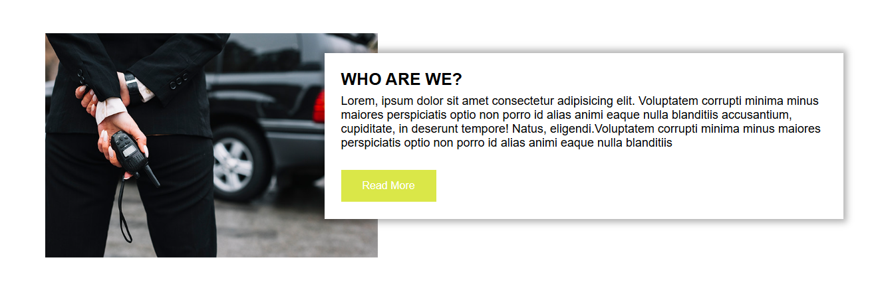

# Guarder Landing Page Demo

A responsive security-services landing page demonstrating semantic HTML, CSS Grid, reusable sections and local form feedback. Guarder is fictional; the page does not offer security services, verified staff, message delivery or newsletter subscriptions.

Existing screenshots preserve the early visual design. Navigation, mobile layouts, contrast and demonstration copy have since been corrected. Original photos remain illustrative; their licensing/source is not documented in this repository.

## Run

Open `index.html`, or run `python -m http.server 8776` and visit http://localhost:8776. `Guarder.html` is retained with identical content for existing links. No installation or build is required. JavaScript enables local form feedback; navigation and layout work without it.

## Features and implementation

The page retains the original hero, about image, three service cards, contact area, staff-image cards and footer. Navigation and calls to action now link to real section IDs. Responsive grids replace fixed 800–1200px widths, and the about card stacks beneath its image on smaller screens. The contact background uses the correct local `contact-bg.jpg` asset. Form inputs have real labels, unique IDs, length limits and native email validation. Images have alternatives and load lazily; focus outlines, a skip link and reduced-motion scrolling improve access.

The contact and newsletter forms explicitly report that nothing was sent, stored or subscribed. Buttons remain disabled before JavaScript initializes; fields have no submission names, so inputs are not placed in native form URLs if scripting is unavailable. No backend or credentials are present. Replace fictional data and configure a real delivery service before using the page commercially.

`Guarder.css` provides shared button styles and responsive section grids. `script.js` validates trimmed required values and handles demo feedback. `Fonts/Poppins.zip` and `Poppins.zip` are original archives retained for history; they are not loaded. The page uses system font fallbacks and no external icon kit.

## Validation and deployment

Run `python scripts/check.py` and `npm run check` (Node.js 22) to verify entry consistency, local images/backgrounds, unique IDs, navigation targets and JavaScript syntax. GitHub Actions runs both. Local DOM interaction checks and browser viewport observations are recorded in the portfolio report; no artificial unit tests were added for static markup.

Suitable for GitHub Pages thanks to the standard `index.html`; no verified public demo is configured. Future work could integrate an explicitly configured contact service and replace illustrative assets with documented licensed images.

Author: Shazeel Ahmed. No license file is present.
